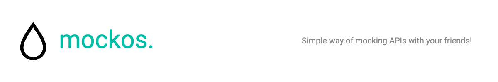

## Mockos - Build mocks for your API without code or config files

Mockos is a **useful and practical tool for developers** looking to test their applications with **custom API mocks**, in a **collaborative way and without the need to install anything** on their computer.
## Live demo

https://mockos.puntaserver.com (Proudly hosted using Coolify.io)

If you find any bugs/vulnerabilities feel free to open a new issue or/and contact me at undernightcore@gmail.com.
## Features

- Create API responses using a **simple JSON editor**.
- Stay in sync with other people thanks to **realtime and compare capabilities**. 
- Create **multiple projects** and invite **multiple members** to help you mock API responses.
- Simplified **branch system** in case you introduce **breaking changes**.


## Run for development (only backend)

Clone the project

```bash
  git clone https://github.com/undernightcore/mockos-back.git
```

Install dependencies

```bash
  npm install
```

Set up DB connection in .env (soon I'll provide a Docker set up)

```bash
  cp .env.example .env
```

Only need to change following variables
```bash
PG_HOST=<change me> 
PG_PORT=<change me>
PG_USER=<change me>
PG_PASSWORD=<change me>
PG_DB_NAME=<change me>

# Leave these blank and verify manually in users table

SMTP_HOST=<change me> 
SMTP_PORT=<change me>
SMTP_USERNAME=<change me>
SMTP_PASSWORD=<change me>

# Leave these blank if verified manually

# Frontend URL for successful verification. 
# Example: https://mockos.puntaserver.com/verify/sucess
VERIFY_SUCCESS_URL=<change me> 

# Frontend URL for successful verification. 
# Example: https://mockos.puntaserver.com/verify/failure
VERIFY_FAILURE_URL=<change me> # Frontend URL for failed verification
```

Run migrations

```bash
  node ace migration:run
```

Start the server

```bash
  node ace serve --watch
```
## Host your own instance using Docker Compose

This will come very soon with v0.0.1...


## Roadmap

- Check what I'm working on here -> https://github.com/users/undernightcore/projects/1


## FAQ

#### What tech stack is this using?

For the Frontend: Angular, Angular Material, JSON editor, Socket.io, Luxon, Swal and Ngrx Translate.

For the Backend: AdonisJS, Socket.io and PostgreSQL.

#### How can I contribute?

Thank you for considering contributing! I am working in an easy contributing guide that you can easily follow. 
## Support

For support, email undernightcore@gmail.com or my twitter @undernightcore. I will happily solve any issue that you may encounter, but first check if there is an already open one. 

